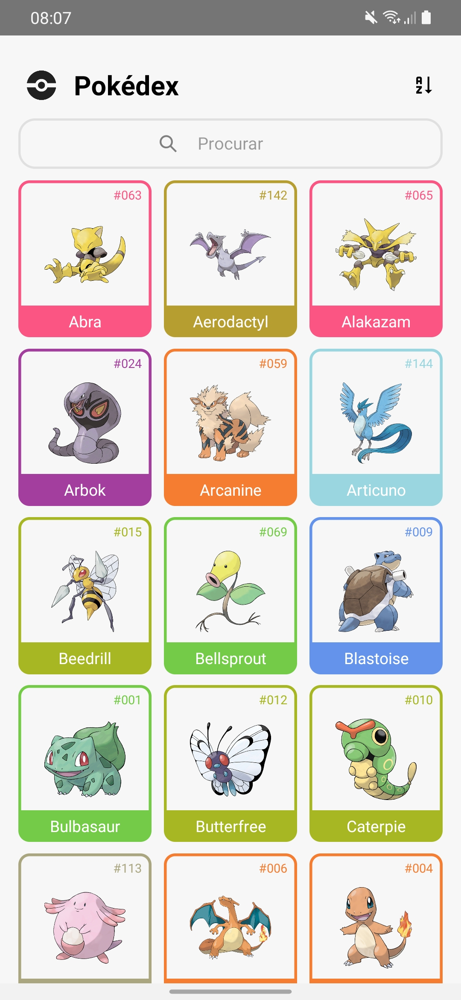

# Desafio MediPreço - Pokédex

Essa é a minha Pokedex que eu criei participando do desafio de **[React Native](https://reactnative.dev/)** proposto pela MediPreço. 

O app foi desenvolvido em **[React Native](https://reactnative.dev/)** utilizando da linguagem tipada **[Typescript](https://www.typescriptlang.org/)**.

Além disso, essa aplicação usufrui da **[PokéAPI](https://pokeapi.co/)**, uma API com dados de Pokémons que são mostrados no app.

# Rodando o projeto

Esse projeto foi criado utilizando a própria [CLI do React Native](https://reactnative.dev/docs/environment-setup). Para rodar a aplicação, basta seguir as instruções abaixo.

1. Abra seu emulador ou conecte seu celular a sua maquina

2. Na raíz do seu projeto, rode o comando `$ npx react-native start`

3. Também na raíz, rode o comando `$ npx react-native run-android`

**OBS**: Caso seja a sua primeira vez configurando o ambiente react native em um linux, recomendo o vídeo abaixo, o qual me ajudou muito: 
* [Vídeo: COMO CONFIGURAR O AMBIENTE REACT NATIVE NO LINUX](https://www.youtube.com/watch?v=aW8-vfxsKLM) 

# APK da Aplicação

Como pedido, foi gerado um arquivo .apk do app para que vocês possam ver a vesão buildada da mesma, segue link abaixo:

* [Link: Pokédex](https://drive.google.com/drive/folders/1JDc-uzsnpLiFuQ7R_ax1GvxRhDfpnW8D?usp=sharing)

# Outros

Aqui irei contar um pouco sobre features extras que eu implementei, curiosidades e meu planejamento durante o tempo de desenvolvimento do projeto.

## Features extras

* [Ok] **Criação de diversos commits e uma história de usuário**: Infelizmente, optei por não seguir um gitflow, pois devido a minhas outras obrigações, priorizei meu tempo em criar histórias de usuário e no desenvolvimento da aplicação.

* [Ok] **Aplicação responsiva**: Testei a responsividade da aplicação em um Samsung Galaxy M31, Moto G5 G, Samsung Galaxy A52 e um emulador Pixel3, em ambas estava responsivas. Infelizmente, não consegui testar em nenhum dispositivo Apple e smartphones androids.

* [OK] **Crie funcionalidades extras**: Foram criadas
    * **Uma animação de loading**: Ao realizar todas as requisições a API é mostrado um feedback de loadin, utilizando a biblioteca [React Native Progress](https://github.com/oblador/react-native-progress);

    * **Easter eggs na barra de pesquisa**: Além de pesquisar pelo nome do pokemon, implementei uma função onde é possível fazer a pesquisa do tipo de cada pokemon, como por exemplo, 'grama' ou 'grass', das habilidades, como, 'blaze' e ao pesquisar 'melhores' ou 'melhores pokemons' retorna uma lista com meus pokemons favoritos (já dou um spoiler de que o Squirtle é o melhor haha);

    * **Tratamento de erros**: Caso não seja feita a conexão com alguma das requisições, a aplicação mostra um feedback simples que ocorreu um erro ao conectar com a API;

## Planejamento

O planejamento do desenvolvimento foi feito seguindo, principalemente, um Backlog de histórias de usuário que eu criei. Dessa forma, conseguir priorizar a implementação de cada funcionalidade a partir do metódo MoSCoW.

Entretanto, antes disso, foi necessário configurar todo o ambiente react native. Dessa vez, aproveitei para fazer com a própria CLI oferecida pelo próprio framework, já que em todas os meus contatos anteriores com react native, eu optei por utilizar o expo.

O planejamento desse app foi um desafio a mais para mim pois, atualmente, estou na reta fian da minha gerencia de um projeto de software da empresa júnior de Engenharia de Software da UnB. Dessa forma, precisei saber organizar bem meu tempo e esforço para que pudesse desenvolver tanto a aplicação como gerenciar minha equipe da melhor forma possível. Assim, o tempo de duração do projeto foi de aproximadamente 3 dias.

## Curiosidades
 
 Aqui gostaria de falar curiosidades sobre mim, tanto em relação ao projeto como sobre meus gostos, então já peço desculpas mas vou usar de uma linguagem mais informal mesmo kkkkkkkkk.

 * Sou um grande grande fã da nintendo, então criar a api foi algo emocionante para mim :) 

 * Em relação a nintendo, meu jogo favorito é Zelda Breath of the Wild, acho perfeito <3

 * Mesmo gostando muito de pokémon, prefiro digimon haha

 * Ter noção da existencia dessa API de pokemon,me fez ter interesse em procurar outras APIs para fazer projetos legais depois e descobri que tem uma de [Rick and Morty](https://rickandmortyapi.com/) e uma de [cachorrinhos](https://thedogapi.com/) :D

* Foi um desafio muito grande conseguir deixar as cores de cada card dinâmica, acho que foi a funcionalidade que mais demorei para conseguir implementar. Mas depois de pesquisaaar MUITO e queimar muitos neurônios, deu tudo certooo kkkkkkk.

* Teve alguns elementos no código que não conseguia descobrir a tipagem :(, se puderem me ajudar depois ficaria mt feliz.

* Por fim, foi um prazer participar do desafio, além de muito divertido. Obrigado pela oportunidade
